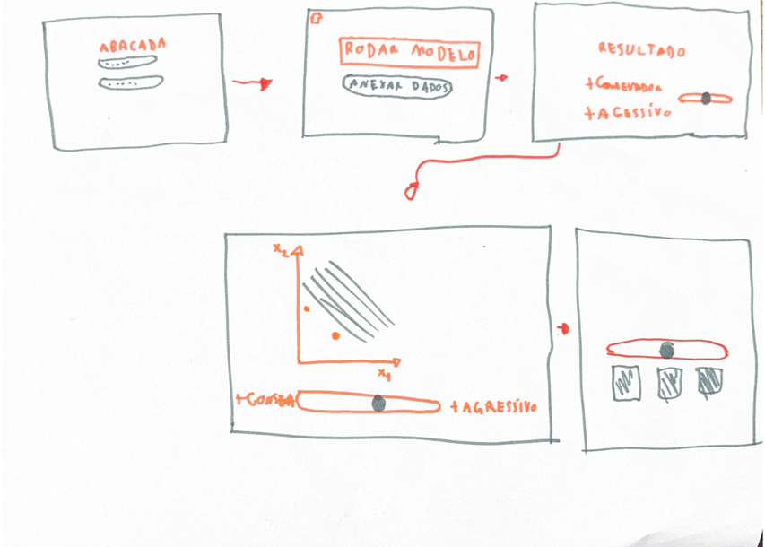
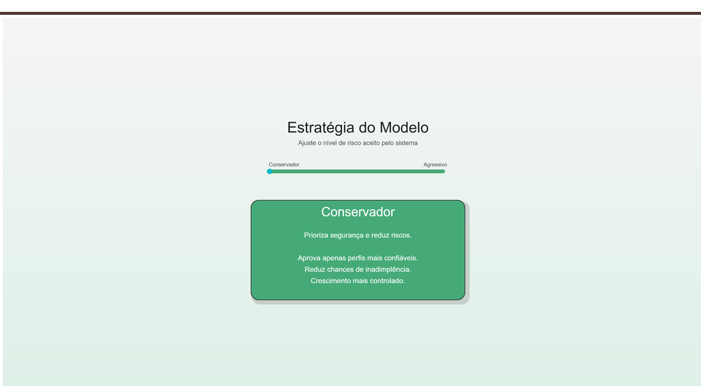
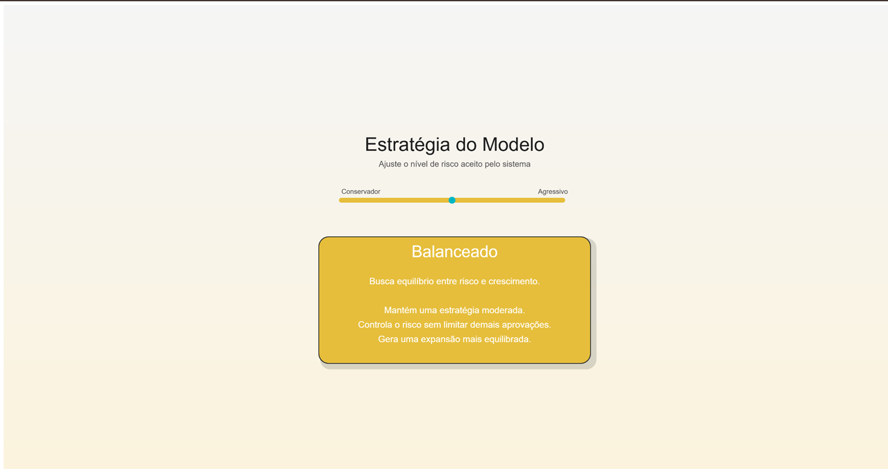
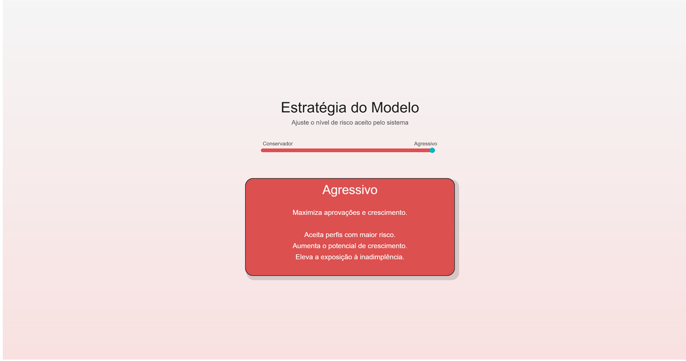

# Projeto em p5

## introdução

Esse projeto consiste em uma interface interativa desenvolvida em p5.js com o objetivo de demonstrar visualmente diferentes abordagens de decisão de um modelo de concessão de crédito. A aplicação permite que o usuário ajuste o comportamento do algoritmo entre os perfis conservador, balanceado e agressivo por meio de um slider dinâmico, recebendo feedback visual e contextual em tempo real sobre os impactos de cada estratégia. Além de facilitar a compreensão do funcionamento do modelo, a interface busca tornar conceitos de risco e crescimento quanto a inadimplência mais intuitivos para os usuários principais que não extremamente técnicos.

## Rascunho Inicial

## Registro do resultado obtido

### Conservador

---

### Balanceado

---

### Agressivo

